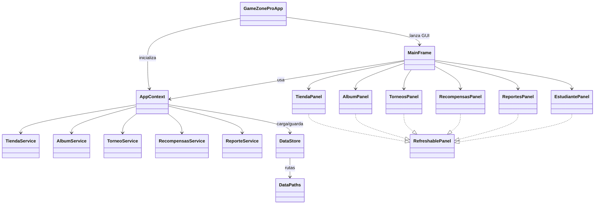
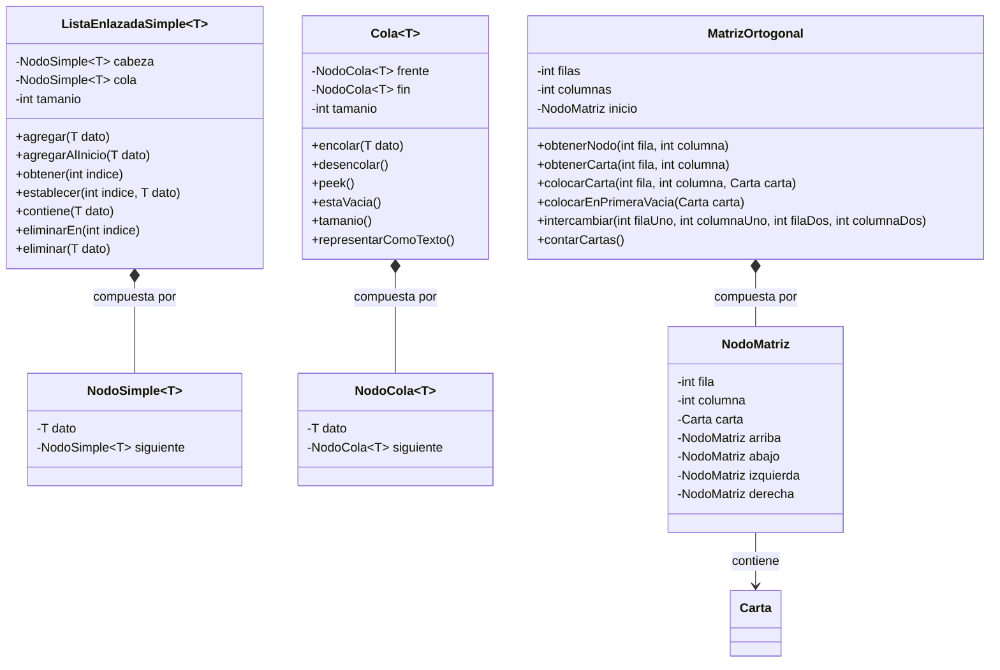
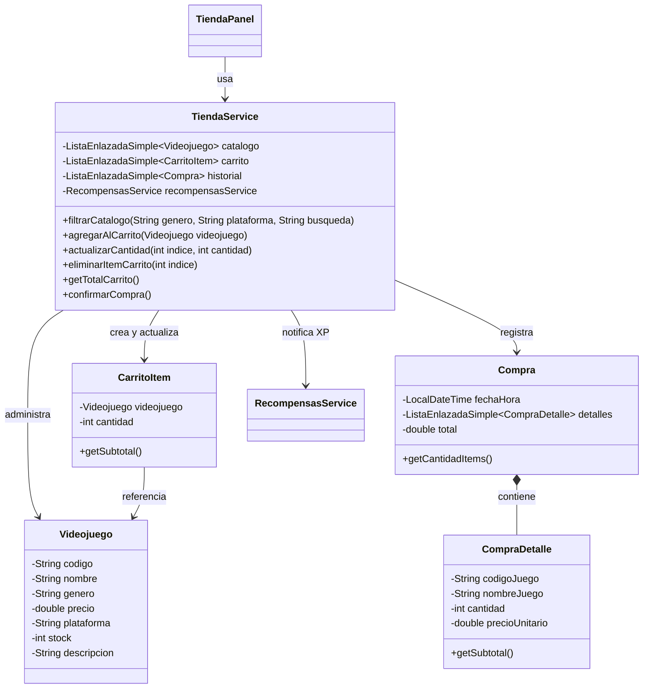
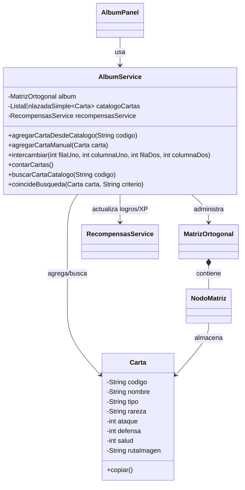
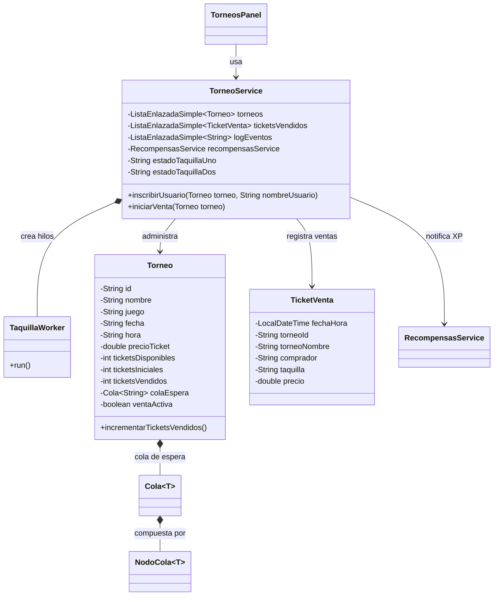
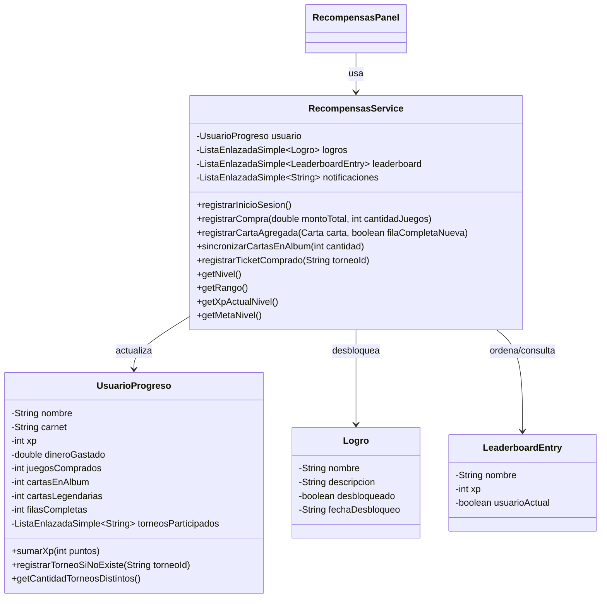
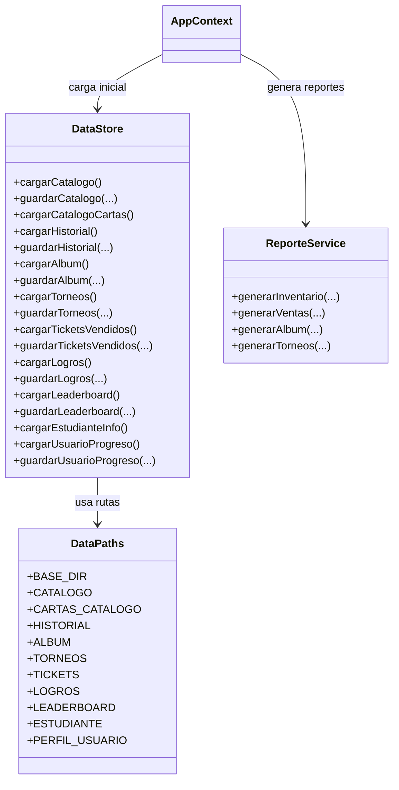

# PROYECTO 2
Curso: Laboratorio de IPC1  
Estudiante: ALVARO MOISÉS GIRÓN MORALES  
Carné: 20250195

# Diagramas de Clases - GameZone Pro

## Descripción general
Este documento contiene los diagramas de clases principales del proyecto **GameZone Pro**.  
Los diagramas están organizados por bloques para que sea más fácil comprender la arquitectura del sistema, las relaciones entre clases, la separación por capas y las estructuras de datos implementadas desde cero.

---

## 1. Diagrama general de arquitectura

### Explicación
- `GameZoneProApp` es el punto de entrada del programa.
- `AppContext` centraliza los datos cargados desde archivos y crea los servicios principales.
- `MainFrame` administra la navegación entre módulos usando la interfaz gráfica Swing.
- Los paneles representan la capa visual.
- Los servicios contienen la lógica del negocio.
- `DataStore` y `DataPaths` manejan la persistencia de datos en archivos de texto.

---

## 2. Diagrama de estructuras de datos propias

### Explicación
- `ListaEnlazadaSimple<T>` se usa en carrito, historial, logros, leaderboard, torneos y tickets vendidos.
- `Cola<T>` se utiliza para la fila de espera de compradores en torneos.
- `MatrizOrtogonal` modela el álbum de cartas mediante nodos enlazados en cuatro direcciones.
- Estas estructuras cumplen con la restricción del proyecto de no usar `ArrayList`, `LinkedList`, `Queue` ni otras colecciones del framework.

---

## 3. Diagrama del módulo Tienda

### Explicación
- `TiendaPanel` muestra el catálogo, carrito e historial.
- `TiendaService` concentra la lógica de búsqueda, filtrado, carrito y confirmación de compra.
- `CarritoItem` encapsula un videojuego y la cantidad solicitada.
- `Compra` representa una venta confirmada y agrupa varios `CompraDetalle`.

---

## 4. Diagrama del módulo Álbum de cartas

### Explicación
- `AlbumPanel` renderiza visualmente el álbum en Swing.
- `AlbumService` encapsula la lógica de agregar cartas, intercambiar posiciones y filtrar contenido.
- `MatrizOrtogonal` y `NodoMatriz` forman la base del álbum matricial.
- `Carta` representa la información de cada carta coleccionable.

---

## 5. Diagrama del módulo Torneos y tickets

### Explicación
- `TorneosPanel` muestra torneos, cola, log y estado de taquillas.
- `TorneoService` administra inscripciones y el proceso concurrente de venta de tickets.
- `TaquillaWorker` representa la clase interna que ejecuta cada hilo de venta.
- `Torneo` mantiene la cola de espera de compradores y el estado de la venta.
- `TicketVenta` guarda el historial de tickets procesados.

---

## 6. Diagrama del módulo Recompensas

### Explicación
- `RecompensasPanel` presenta la información visual de XP, nivel, rango, logros y leaderboard.
- `RecompensasService` centraliza la lógica de gamificación del sistema.
- `UsuarioProgreso` almacena el estado acumulado del jugador.
- `Logro` representa cada logro desbloqueable.
- `LeaderboardEntry` modela cada fila del tablero de líderes.

---

## 7. Diagrama de persistencia y reportes

### Explicación
- `DataPaths` centraliza las rutas de los archivos de datos.
- `DataStore` se encarga de leer y escribir archivos `.txt` con la información persistente del sistema.
- `ReporteService` genera los reportes HTML solicitados por el proyecto.

---

## 8. Resumen de relaciones más importantes

### Relaciones de composición
- `ListaEnlazadaSimple` contiene `NodoSimple`.
- `Cola` contiene `NodoCola`.
- `MatrizOrtogonal` contiene `NodoMatriz`.
- `Compra` contiene varios `CompraDetalle`.
- `Torneo` contiene una `Cola<String>` para la fila de espera.

### Relaciones de dependencia
- Los paneles dependen de sus servicios correspondientes.
- Los servicios dependen de los modelos y estructuras de datos.
- `AppContext` coordina la inicialización global del sistema.
- `DataStore` depende de `DataPaths` para localizar los archivos.

### Relaciones funcionales
- `TiendaService`, `AlbumService` y `TorneoService` notifican eventos a `RecompensasService`.
- `ReporteService` toma información del contexto general para generar archivos HTML.
- `MainFrame` reúne todos los paneles y permite la navegación entre módulos.

