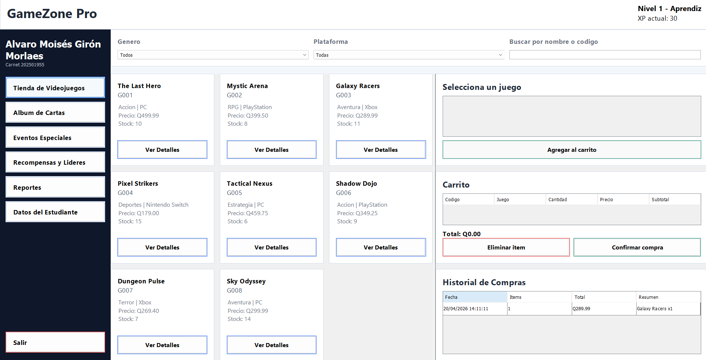

# PROYECTO 2
**Curso:** Laboratorio de IPC1  
**Estudiante:** ALVARO MOISÉS GIRÓN MORALES  
**Carné:** 20250195

---

# Manual de Usuario
## GameZone Pro

## 1. Introducción
Este manual de usuario explica el funcionamiento general de la aplicación **GameZone Pro**, desarrollada en **Java Swing**. El objetivo de este documento es guiar al usuario en el uso de cada módulo del sistema, indicando los pasos principales y dejando espacios sugeridos para agregar capturas de pantalla del programa en funcionamiento.

Este manual está pensado para acompañar la entrega del proyecto y mostrar, de manera ordenada, cómo se utiliza la aplicación desde que se ejecuta hasta que se generan reportes o se consulta la información del estudiante.

---

## 2. Requisitos para ejecutar el sistema
Para utilizar la aplicación, se recomienda lo siguiente:

- Tener instalado **Java** en el equipo.
- Abrir el proyecto desde **NetBeans** o ejecutar el archivo **.jar** generado.
- Contar con los archivos de datos del sistema dentro del proyecto para que la aplicación cargue correctamente la información.

### Pasos para iniciar el programa
1. Abrir el proyecto `PROYECTO2` en NetBeans, o bien ejecutar el archivo `.jar`.
2. Ejecutar la clase principal del sistema.
3. Esperar a que aparezca la ventana principal de **GameZone Pro**.

---

## 3. Pantalla principal
Al iniciar el sistema, se muestra el menú principal de la aplicación. Desde esta pantalla el usuario puede acceder a todos los módulos disponibles.

### Opciones del menú principal
- Tienda de Videojuegos
- Álbum de Cartas
- Eventos Especiales
- Recompensas y Líderes
- Reportes
- Datos del Estudiante
- Salir

### Pasos de uso
1. Iniciar la aplicación.
2. Ubicar el menú principal.
3. Hacer clic en el módulo que se desea utilizar.
4. Para volver al menú principal, usar el botón de regreso disponible en cada módulo.

**Espacio para captura:**  
`[Insertar aquí captura del menú principal con todas las opciones visibles]`

---

## 4. Módulo de Tienda de Videojuegos
Este módulo permite consultar el catálogo de videojuegos, buscar productos, agregarlos al carrito y confirmar compras.

### 4.1 Ver catálogo de juegos
En esta sección el usuario puede visualizar los juegos disponibles en la tienda.

#### Pasos
1. Ingresar al módulo **Tienda de Videojuegos**.
2. Observar la lista o tarjetas de juegos disponibles.
3. Revisar la información mostrada de cada juego.

**Espacio para captura:**  
`[Insertar aquí captura del catálogo de videojuegos]`

### 4.2 Buscar y filtrar juegos
La tienda permite buscar juegos por nombre o código y aplicar filtros por categoría.

#### Pasos
1. Ubicar el campo de búsqueda.
2. Escribir el nombre o código del videojuego.
3. Usar los filtros disponibles, como género o plataforma.
4. Revisar cómo se actualizan los resultados mostrados.

**Espacio para captura:**  
`[Insertar aquí captura usando el buscador o filtros]`

### 4.3 Ver detalles de un juego
El sistema permite seleccionar un juego para revisar sus datos específicos.

#### Pasos
1. Seleccionar un juego del catálogo.
2. Presionar el botón correspondiente para ver detalles.
3. Revisar la información completa del producto.

**Espacio para captura:**  
`[Insertar aquí captura de la ventana o panel de detalles del juego]`

### 4.4 Agregar productos al carrito
Una vez seleccionado un juego, se puede agregar al carrito de compra.

#### Pasos
1. Seleccionar el videojuego deseado.
2. Presionar el botón **Agregar al carrito**.
3. Verificar que el juego aparezca en la sección del carrito.

**Espacio para captura:**  
`[Insertar aquí captura del carrito con productos agregados]`

### 4.5 Modificar o eliminar productos del carrito
El usuario puede cambiar cantidades o eliminar productos antes de confirmar la compra.

#### Pasos
1. Ubicar la tabla o lista del carrito.
2. Editar la cantidad del producto si el sistema lo permite.
3. Seleccionar un producto y presionar el botón de eliminar.
4. Confirmar que el carrito se actualice correctamente.

**Espacio para captura:**  
`[Insertar aquí captura modificando cantidades o eliminando un item]`

### 4.6 Confirmar compra
Cuando el usuario finaliza la selección de productos, puede procesar la compra.

#### Pasos
1. Revisar los productos agregados al carrito.
2. Presionar el botón **Confirmar compra**.
3. Esperar el mensaje de confirmación del sistema.
4. Verificar que el historial de compras se actualice.

> Nota: Si un producto no tiene stock suficiente, el sistema mostrará un mensaje de advertencia.

**Espacio para captura:**  
`[Insertar aquí captura del mensaje de compra exitosa o advertencia de stock]`

### 4.7 Ver historial de compras
El sistema almacena las compras realizadas y las muestra dentro del módulo.

#### Pasos
1. Permanecer dentro del módulo de tienda.
2. Ubicar la sección **Historial de compras**.
3. Revisar las compras registradas.

**Espacio para captura:**  
`[Insertar aquí captura del historial de compras]`

---

## 5. Módulo de Álbum de Cartas
Este módulo permite administrar un álbum de cartas coleccionables, agregar cartas, buscarlas e intercambiarlas.

### 5.1 Visualizar el álbum
El álbum muestra una cuadrícula con espacios vacíos o cartas ya agregadas.

#### Pasos
1. Ingresar al módulo **Álbum de Cartas**.
2. Observar la cuadrícula del álbum.
3. Identificar celdas vacías y cartas existentes.

**Espacio para captura:**  
`[Insertar aquí captura general del álbum de cartas]`

### 5.2 Agregar una carta desde el catálogo
El usuario puede añadir cartas disponibles al álbum.

#### Pasos
1. Ubicar la opción para seleccionar una carta.
2. Elegir el código o carta deseada.
3. Presionar el botón **Agregar Carta**.
4. Confirmar que la carta aparezca en la primera posición vacía disponible.

**Espacio para captura:**  
`[Insertar aquí captura agregando una carta al álbum]`

### 5.3 Crear una carta manualmente
El sistema permite registrar cartas nuevas con sus atributos.

#### Pasos
1. Presionar el botón **Crear Carta Manual**.
2. Ingresar los datos solicitados por el sistema.
3. Confirmar la creación de la carta.
4. Verificar que la carta se agregue al álbum.

**Espacio para captura:**  
`[Insertar aquí captura del formulario para crear una carta]`

### 5.4 Buscar cartas dentro del álbum
Se puede realizar una búsqueda para resaltar cartas específicas.

#### Pasos
1. Ubicar el campo de búsqueda del álbum.
2. Escribir el nombre, tipo o rareza de la carta.
3. Revisar el resaltado de las coincidencias encontradas.

**Espacio para captura:**  
`[Insertar aquí captura mostrando cartas resaltadas por búsqueda]`

### 5.5 Ver detalles de una carta
Al seleccionar una carta, el sistema muestra sus atributos.

#### Pasos
1. Hacer clic sobre una carta del álbum.
2. Revisar el panel lateral o sección de detalles.
3. Verificar información como nombre, tipo, ataque, defensa o rareza.

**Espacio para captura:**  
`[Insertar aquí captura del panel de detalles de una carta]`

### 5.6 Intercambiar cartas
El sistema permite reorganizar el álbum intercambiando posiciones.

#### Pasos
1. Seleccionar la primera carta o celda.
2. Seleccionar la segunda carta o celda.
3. Presionar el botón **Intercambiar Seleccionadas**.
4. Confirmar que las posiciones cambien correctamente.

**Espacio para captura:**  
`[Insertar aquí captura del intercambio de cartas]`

---

## 6. Módulo de Eventos Especiales
Este módulo gestiona torneos y la venta de tickets utilizando cola e hilos concurrentes.

### 6.1 Ver torneos disponibles
El sistema muestra los torneos cargados en la aplicación.

#### Pasos
1. Ingresar al módulo **Eventos Especiales**.
2. Revisar la tabla o lista de torneos disponibles.
3. Seleccionar un torneo para ver su información.

**Espacio para captura:**  
`[Insertar aquí captura de la lista de torneos]`

### 6.2 Inscribirse a la cola
El usuario puede registrarse en la cola de espera para comprar un ticket.

#### Pasos
1. Seleccionar un torneo disponible.
2. Escribir el nombre del participante.
3. Presionar el botón **Inscribirse a la Cola**.
4. Confirmar que el nombre aparezca en la cola del torneo.

**Espacio para captura:**  
`[Insertar aquí captura del registro de un usuario en la cola]`

### 6.3 Iniciar taquillas concurrentes
El proceso de venta se realiza mediante hilos que atienden la cola.

#### Pasos
1. Asegurarse de tener personas inscritas en la cola.
2. Presionar el botón **Iniciar Taquillas**.
3. Observar el estado de cada taquilla.
4. Revisar la cola restante y el log de ventas en tiempo real.

**Espacio para captura:**  
`[Insertar aquí captura de las taquillas procesando tickets]`

### 6.4 Ver tickets vendidos
El sistema muestra el historial o registro de tickets procesados.

#### Pasos
1. Ubicar el área de historial o log de ventas.
2. Revisar los tickets ya vendidos por las taquillas.
3. Confirmar cuándo termina el proceso por falta de tickets o por cola vacía.

**Espacio para captura:**  
`[Insertar aquí captura del historial de tickets vendidos]`

---

## 7. Módulo de Recompensas y Líderes
Este módulo permite visualizar el avance del usuario en puntos, logros y posiciones del leaderboard.

### 7.1 Consultar experiencia y nivel
Aquí se muestra el progreso general del usuario.

#### Pasos
1. Ingresar al módulo **Recompensas y Líderes**.
2. Revisar la cantidad de XP acumulada.
3. Observar el nivel actual, rango y barra de progreso.

**Espacio para captura:**  
`[Insertar aquí captura del panel de XP, nivel y barra de progreso]`

### 7.2 Consultar logros
El sistema muestra los logros desbloqueados y los pendientes.

#### Pasos
1. Ubicar la sección de logros.
2. Revisar cuáles logros están bloqueados y cuáles ya fueron desbloqueados.
3. Verificar si el sistema muestra algún aviso o notificación al completar un logro.

**Espacio para captura:**  
`[Insertar aquí captura de la sección de logros]`

### 7.3 Consultar leaderboard
El tablero de líderes muestra el ranking de usuarios.

#### Pasos
1. Ubicar la tabla del leaderboard.
2. Revisar las posiciones de los usuarios con mayor experiencia.
3. Identificar la posición del usuario actual dentro del sistema.

**Espacio para captura:**  
`[Insertar aquí captura del leaderboard]`

---

## 8. Módulo de Reportes
La aplicación permite generar reportes en formato HTML con información importante del sistema.

### Tipos de reportes disponibles
- Reporte de Inventario de Tienda
- Reporte de Ventas
- Reporte del Álbum
- Reporte de Torneos

### Pasos para generar reportes
1. Ingresar al módulo **Reportes**.
2. Seleccionar el tipo de reporte que se desea generar.
3. Presionar el botón correspondiente.
4. Esperar a que el sistema genere y abra el archivo HTML.
5. Revisar el contenido del reporte en el navegador.

**Espacio para captura:**  
`[Insertar aquí captura del módulo de reportes]`

**Espacio para captura adicional:**  
`[Insertar aquí captura de un reporte HTML abierto en el navegador]`

---

## 9. Módulo de Datos del Estudiante
Esta sección muestra la información académica y general del desarrollador del proyecto.

### Datos mostrados
- Nombre completo
- Carné
- CUI
- Correo electrónico
- Sección
- Semestre
- Descripción del proyecto

### Pasos
1. Ingresar al módulo **Datos del Estudiante**.
2. Revisar la información personal y académica desplegada en pantalla.

**Espacio para captura:**  
`[Insertar aquí captura del panel de datos del estudiante]`

---

## 10. Salida del sistema
La aplicación cuenta con una opción para finalizar su ejecución de forma ordenada.

### Pasos
1. Volver al menú principal.
2. Presionar la opción **Salir**.
3. Esperar a que la aplicación cierre correctamente.

> Durante el cierre, el sistema puede guardar información importante en archivos, como historial de compras, álbum o tickets vendidos.

**Espacio para captura:**  
`[Insertar aquí captura del botón salir o del cierre de la aplicación]`

---

## 11. Recomendaciones de uso
- Verificar que los archivos de datos existan antes de ejecutar la aplicación.
- Confirmar que los formularios estén llenos correctamente antes de guardar información.
- Revisar el stock de productos antes de confirmar compras.
- En el módulo de torneos, agregar varios participantes para observar mejor el comportamiento de las taquillas concurrentes.
- Generar al menos un reporte de cada tipo para documentar correctamente el funcionamiento del sistema.

---

## 12. Conclusión
GameZone Pro es una aplicación de escritorio que integra distintos módulos funcionales en un solo sistema: tienda, álbum, torneos, recompensas, reportes y datos del estudiante. Este manual permite documentar el uso del programa paso a paso y facilita la incorporación de capturas de pantalla para respaldar visualmente el funcionamiento de la aplicación.

